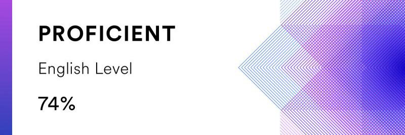

>For rolling-scopes-school task: https://github.com/rolling-scopes-school/tasks/blob/master/tasks/cv/cv.md


# Sharlai Anton #
### Junior Front-End Developer

---
### Contact information:
* **Phone:** +38 067 657-****
* **E-mail:** s\*\*\*k@gmail.com
* **Telegram:** @Sharlaychik
* **LinkedIn:** [www.linkedin.com/in/anton-sharlai-1182b8223](www.linkedin.com/in/anton-sharlai-1182b8223)
* **Discord:** @Sharlaychik (Anton Sharlai)

---
### Briefly About Myself #
_I am 37 years old. I have always liked programming, robotics, radio electronics. I got acquainted with Arduino and unlimited possibilities through programming. Now I decided to completely plunge into the world of programming and automation. Decided to start with Front End. And in the future I will study Beck End, for a complete understanding of all the details of the automation process. I studied everything on my own and realized that I finally found what I like to do all the time._

_I can't wait to apply my knowledge to real projects and start a career in this field._

---
### Basic Skills and Proficiency:
  * ARDUINO
  * Adobe Photoshop
  * HTML/CSS
  * Responsive Web Design
  * PHP
  * SQL
  * JavaScript
  * TypeScript
  * jQuery
  * React (hooks) /Reduxe
  * Webpack
  * npm
  * GIT

---
### Code example:
**KATA from CODEWARS:** Write a function that takes a string of parentheses, and determines if the order of the parentheses is valid. The function should return true if the string is valid, and false if it's invalid.

```
function validParentheses(parens) {
  let answ = true
  let reg = /\(\)/g
  
  while (parens.search(reg) !== -1){
    parens = parens.replace(reg,"")
  }
  
  if (parens.length >= 1)
  answ = false
    
  return answ
}
```

---
### Education/Courses:
  * [Sololearn](https://www.sololearn.com/profile/22830185)
  * [Metanit](metanit.com)
  * [codewars](https://www.codewars.com/users/sharlaychik)
  * [Learn.javascript](learn.javascript.ru)
  * [Developer mozilla](developer.mozilla.org)
  * [freeCodeCamp](freecodecamp.org)
  * other sources...

  ---
### Languages:
  * Ukrainian - Native
  * Russian - Native
  * English - Intermediate (according to the online test at [EFset](www.efset.org)\)
